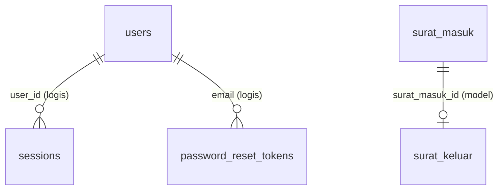

# Data Dictionary

Dokumen ini merangkum struktur tabel database berdasarkan migration yang ada di project.

## Ringkasan Tabel

| Tabel | Fungsi |
|---|---|
| users | Data akun pengguna aplikasi |
| password_reset_tokens | Token reset password |
| sessions | Penyimpanan session database driver |
| cache | Data cache database store |
| cache_locks | Lock untuk cache |
| jobs | Queue jobs (database queue) |
| job_batches | Batch queue jobs |
| failed_jobs | Log queue job gagal |
| surat_masuk | Data surat masuk dan data balasan surat keluar |

## Relasi Tabel

### Relasi Aktual di Database

| Sumber | Target | Kardinalitas | Implementasi | Keterangan |
|---|---|---|---|---|
| `sessions.user_id` | `users.id` | N:1 (opsional) | Index kolom (tanpa FK constraint) | Session dapat tidak terhubung user (guest), atau terhubung ke satu user login |

### Relasi Logis (Level Aplikasi)

| Sumber | Target | Kardinalitas | Implementasi | Keterangan |
|---|---|---|---|---|
| `password_reset_tokens.email` | `users.email` | N:1 | Relasi logis berdasarkan email | Token reset password terkait akun user berdasarkan email |
| `surat_keluar.surat_masuk_id` | `surat_masuk.id` | 1:1 (opsional) | Didefinisikan di model Eloquent (`belongsTo`/`hasOne`) | Belum ada migration aktif untuk tabel `surat_keluar`, sehingga relasi ini belum menjadi FK DB |

### Diagram Relasi (Konseptual)

## Tabel: `users`

| Kolom | Tipe | Null | Key/Index | Default | Keterangan |
|---|---|---|---|---|---|
| id | BIGINT UNSIGNED | Tidak | PK | auto increment | ID user |
| name | VARCHAR(255) | Tidak | - | - | Nama user |
| email | VARCHAR(255) | Tidak | UNIQUE | - | Email login |
| phone | VARCHAR(50) | Ya | - | NULL | Nomor telepon |
| email_verified_at | TIMESTAMP | Ya | - | NULL | Waktu verifikasi email |
| password | VARCHAR(255) | Tidak | - | - | Password hash |
| role | VARCHAR(255) | Tidak | - | `user` | Role: `admin`, `pimpinan`, `user` |
| remember_token | VARCHAR(100) | Ya | - | NULL | Token remember me |
| created_at | TIMESTAMP | Ya | - | NULL | Timestamp dibuat |
| updated_at | TIMESTAMP | Ya | - | NULL | Timestamp diubah |

## Tabel: `password_reset_tokens`

| Kolom | Tipe | Null | Key/Index | Default | Keterangan |
|---|---|---|---|---|---|
| email | VARCHAR(255) | Tidak | PK | - | Email pemilik token |
| token | VARCHAR(255) | Tidak | - | - | Token reset password |
| created_at | TIMESTAMP | Ya | - | NULL | Waktu pembuatan token |

## Tabel: `sessions`

| Kolom | Tipe | Null | Key/Index | Default | Keterangan |
|---|---|---|---|---|---|
| id | VARCHAR(255) | Tidak | PK | - | ID session |
| user_id | BIGINT UNSIGNED | Ya | INDEX | NULL | Referensi user login (logis ke `users.id`, tanpa FK DB) |
| ip_address | VARCHAR(45) | Ya | - | NULL | IP client |
| user_agent | TEXT | Ya | - | NULL | User agent browser |
| payload | LONGTEXT | Tidak | - | - | Data session terenkripsi/serialized |
| last_activity | INT | Tidak | INDEX | - | Unix timestamp aktivitas terakhir |

## Tabel: `cache`

| Kolom | Tipe | Null | Key/Index | Default | Keterangan |
|---|---|---|---|---|---|
| key | VARCHAR(255) | Tidak | PK | - | Cache key |
| value | MEDIUMTEXT | Tidak | - | - | Nilai cache |
| expiration | INT | Tidak | - | - | Waktu kadaluarsa (unix timestamp) |

## Tabel: `cache_locks`

| Kolom | Tipe | Null | Key/Index | Default | Keterangan |
|---|---|---|---|---|---|
| key | VARCHAR(255) | Tidak | PK | - | Kunci lock |
| owner | VARCHAR(255) | Tidak | - | - | Pemilik lock |
| expiration | INT | Tidak | - | - | Kadaluarsa lock (unix timestamp) |

## Tabel: `jobs`

| Kolom | Tipe | Null | Key/Index | Default | Keterangan |
|---|---|---|---|---|---|
| id | BIGINT UNSIGNED | Tidak | PK | auto increment | ID job |
| queue | VARCHAR(255) | Tidak | INDEX | - | Nama queue |
| payload | LONGTEXT | Tidak | - | - | Payload job |
| attempts | TINYINT UNSIGNED | Tidak | - | - | Jumlah percobaan |
| reserved_at | INT UNSIGNED | Ya | - | NULL | Waktu job di-reserve |
| available_at | INT UNSIGNED | Tidak | - | - | Waktu job siap diproses |
| created_at | INT UNSIGNED | Tidak | - | - | Waktu job dibuat |

## Tabel: `job_batches`

| Kolom | Tipe | Null | Key/Index | Default | Keterangan |
|---|---|---|---|---|---|
| id | VARCHAR(255) | Tidak | PK | - | ID batch |
| name | VARCHAR(255) | Tidak | - | - | Nama batch |
| total_jobs | INT | Tidak | - | - | Total job |
| pending_jobs | INT | Tidak | - | - | Job pending |
| failed_jobs | INT | Tidak | - | - | Job gagal |
| failed_job_ids | LONGTEXT | Tidak | - | - | Daftar ID job gagal |
| options | MEDIUMTEXT | Ya | - | NULL | Opsi batch |
| cancelled_at | INT | Ya | - | NULL | Waktu batch dibatalkan |
| created_at | INT | Tidak | - | - | Waktu batch dibuat |
| finished_at | INT | Ya | - | NULL | Waktu batch selesai |

## Tabel: `failed_jobs`

| Kolom | Tipe | Null | Key/Index | Default | Keterangan |
|---|---|---|---|---|---|
| id | BIGINT UNSIGNED | Tidak | PK | auto increment | ID failed job |
| uuid | VARCHAR(255) | Tidak | UNIQUE | - | UUID job |
| connection | TEXT | Tidak | - | - | Nama koneksi queue |
| queue | TEXT | Tidak | - | - | Nama queue |
| payload | LONGTEXT | Tidak | - | - | Payload job |
| exception | LONGTEXT | Tidak | - | - | Detail exception |
| failed_at | TIMESTAMP | Tidak | - | CURRENT_TIMESTAMP | Waktu gagal |

## Tabel: `surat_masuk`

| Kolom | Tipe | Null | Key/Index | Default | Keterangan |
|---|---|---|---|---|---|
| id | BIGINT UNSIGNED | Tidak | PK | auto increment | ID surat masuk |
| asal_surat | VARCHAR(255) | Tidak | - | - | Instansi/pengirim surat |
| perihal | VARCHAR(255) | Tidak | - | - | Perihal surat masuk |
| tanggal_surat | DATE | Tidak | - | - | Tanggal pada surat masuk |
| file_surat | VARCHAR(255) | Ya | - | NULL | Path file surat masuk |
| no_surat_balasan | VARCHAR(255) | Ya | - | NULL | Nomor surat balasan |
| tanggal_balasan | DATE | Ya | - | NULL | Tanggal surat balasan |
| tujuan_surat | VARCHAR(255) | Ya | - | NULL | Tujuan surat balasan |
| perihal_balasan | TEXT | Ya | - | NULL | Perihal surat balasan |
| file_balasan | VARCHAR(255) | Ya | - | NULL | Path file surat balasan |
| status | ENUM('Belum Dibalas','Sudah Dibalas') | Tidak | - | `Belum Dibalas` | Status tindak lanjut surat |
| created_at | TIMESTAMP | Ya | - | NULL | Timestamp dibuat |
| updated_at | TIMESTAMP | Ya | - | NULL | Timestamp diubah |

## Catatan Penting

1. Tidak ada migration aktif untuk tabel `surat_keluar`. Operasional balasan surat saat ini disimpan langsung di tabel `surat_masuk`.
2. Kolom `no_surat`, `perihal_lainnya`, dan `perihal_lainnya_keluar` muncul di model `SuratMasuk`, tetapi tidak ditemukan pada migration tabel `surat_masuk`.
3. Sebagian relasi bersifat logis di level aplikasi (contoh `sessions.user_id` ke `users.id`) tanpa foreign key constraint di database.
