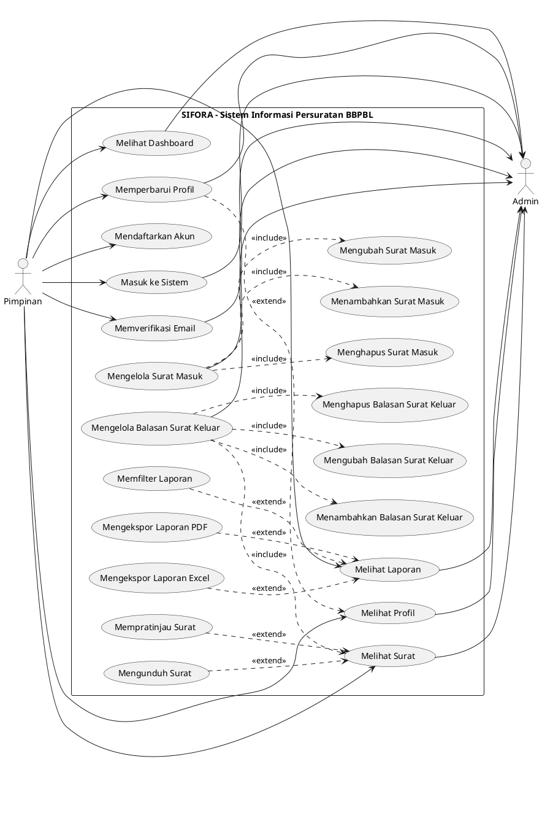

# Use Case SIFORA (Surat BBPBL)

## Ringkasan
SIFORA adalah aplikasi pengelolaan surat masuk dan balasan surat keluar untuk BBPBL.  
Fitur utama aplikasi mencakup manajemen surat, monitoring status balasan, serta pembuatan laporan dengan ekspor PDF/Excel.

## Aktor
1. `Admin`
2. `Pimpinan` (akses baca/monitoring)

## Use Case Utama
1. `Mendaftarkan Akun`
2. `Masuk ke Sistem`
3. `Memverifikasi Email`
4. `Melihat Dashboard`
5. `Mengelola Surat Masuk`
6. `Menambahkan Surat Masuk`
7. `Mengubah Surat Masuk`
8. `Menghapus Surat Masuk`
9. `Mengelola Balasan Surat Keluar`
10. `Menambahkan Balasan Surat Keluar`
11. `Mengubah Balasan Surat Keluar`
12. `Menghapus Balasan Surat Keluar`
13. `Melihat Surat`
14. `Mempratinjau Surat`
15. `Mengunduh Surat`
16. `Melihat Laporan`
17. `Memfilter Laporan`
18. `Mengekspor Laporan PDF`
19. `Mengekspor Laporan Excel`
20. `Melihat Profil`
21. `Memperbarui Profil`

## Hak Akses Singkat
- `Admin`: mengakses fitur operasional surat dan seluruh fitur monitoring.
- `Pimpinan`: mengakses registrasi, monitoring, laporan, dan profil tanpa aksi ubah data surat.

## Kode PlantUML (Use Case Diagram)

